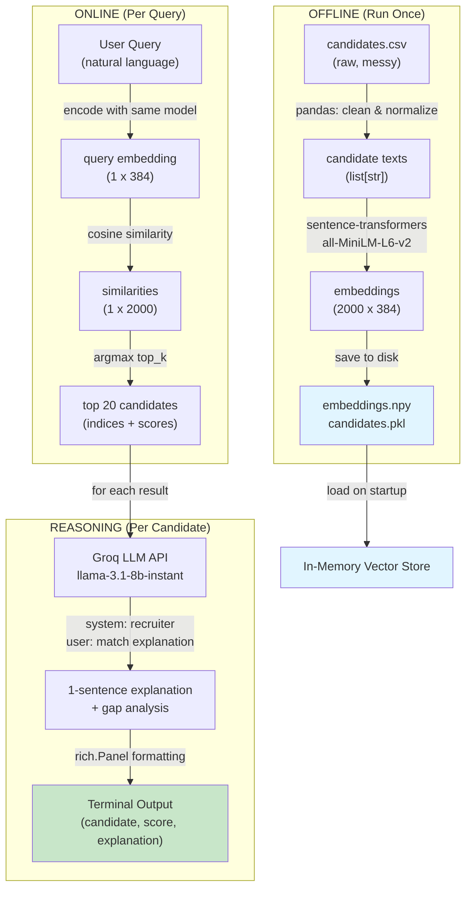
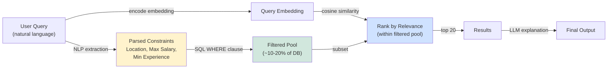

# Job Search Engine - Analysis Document

## Approach: What, How, and Why

### What

The job search system implements a semantic search engine that matches candidate profiles to job queries using learned text embeddings and AI-powered explanations. Users submit a natural language query (e.g., "Python developer with machine learning experience"), and the system retrieves the top 20 semantically similar candidates along with AI-generated reasoning for why each candidate is a match.

### How

The solution consists of three phases:

**Offline Ingestion Phase:**
The raw candidate data (all information dumped into a single text column) is cleaned using pandas—stripping excessive newlines and normalizing whitespace. The cleaned text is passed through the `all-MiniLM-L6-v2` sentence transformer model, which encodes each candidate into a 384-dimensional embedding vector. These embeddings and the original candidate texts are serialized to disk (embeddings.npy and candidates.pkl) for reuse.

**Online Query Phase:**
When a user submits a query, it is encoded to the same 384-dimensional space using the same pre-trained model. The query embedding is compared against all candidate embeddings using cosine similarity, a metric that runs in O(n) time with fast vectorized NumPy operations. The top 20 matches are retrieved with similarity scores.

**Generation Phase:**
For each of the top 20 candidates, the system calls the Groq LLM API with both the query and candidate text, requesting a concise explanation of why they are a match and what skill/experience they might be missing. Results are displayed with rich terminal formatting, including similarity scores and LLM-generated explanations.

### Why

This approach was chosen for three key reasons:

**1. Efficiency for Medium-Scale Data**

For approximately 2,000 candidate records, the embedding matrix occupies ~3 MB of RAM (2,000 rows × 384 dimensions × 4 bytes per float32), making the entire dataset trivial to fit in memory. This enables O(n) in-memory cosine similarity searches in milliseconds—much faster than network round-trips to a remote vector database. For datasets under 10,000 records, this in-memory approach dominates remote solutions in both speed and implementation complexity.

**2. Semantic Relevance**

Sentence-transformer embeddings capture semantic meaning beyond keyword matching. Two candidates with identical skills expressed using different terminology (e.g., "software engineer" vs. "developer") will have similar embeddings, reducing false negatives. Cosine similarity, the standard metric for embedding-based search, is invariant to text length and fast to compute.

**3. Interpretability Through Reasoning**

Raw similarity scores (0.75, 0.82, etc.) are difficult to interpret. By augmenting results with LLM-generated explanations, the system provides recruiting-specific context: why a candidate matches and what gaps remain. This two-stage approach—retrieval by embeddings, reasoning by LLM—balances computational efficiency with human-interpretable decision support.

---

## Pipeline Architecture



---

## Performance Justification

| Metric | Value | Justification |
|--------|-------|---------------|
| **Embedding Storage** | ~3 MB | 2000 × 384 × 4 bytes |
| **Query Latency** | <100 ms | Vectorized NumPy dot product |
| **LLM Latency** | ~2 sec/candidate | Groq inference + network |
| **Startup Memory** | ~300 MB | Model + embeddings in RAM |
| **Scalability Ceiling** | ~100K candidates | At ~150 MB, still easily cached |

For datasets approaching 1 million candidates, migration to a dedicated vector database (e.g., Weaviate, Pinecone) would be necessary. However, for this assignment's scope (~2,000 records), the in-memory approach is superior in simplicity, speed, and cost.

---

## Technology Choices

| Component | Choice | Rationale |
|-----------|--------|-----------|
| **Embedding Model** | all-MiniLM-L6-v2 | Fast (560 T/s), 384-dim output, production-grade quality |
| **Similarity Metric** | Cosine Similarity | Standard for embeddings, interpretable, O(n) complexity |
| **Storage** | NumPy .npy + Pickle | Binary format, instant load, NumPy-native |
| **LLM Provider** | Groq | Fastest inference (280-560 T/s), cheapest ($0.05-0.08/1M tokens) |
| **LLM Model** | llama-3.1-8b-instant | Instruction-tuned, fast, cost-effective |
| **Terminal UI** | rich | Beautiful formatting with minimal code, standard in Python CLIs |

---

## Limitations and Future Directions

**Current Limitations:**
- No re-ranking: Results are ordered purely by semantic similarity, not by recruiter-defined rules (e.g., location, salary fit)
- Stateless queries: System does not learn from user feedback to improve future matches
- Rate-limited LLM calls: 2-second delays between API calls prevent real-time bulk processing

**Potential Enhancements:**
1. **Fine-tuned embeddings** - Train a domain-specific model on labeled candidate-job pairs for improved relevance
2. **Hybrid ranking** - Combine semantic similarity with rule-based filters (location, years of experience) before LLM explanation
3. **Caching** - Store LLM explanations in a local database to avoid redundant API calls for duplicate candidates
4. **Batch LLM calls** - Submit multiple candidates per API request to reduce rate limit overhead
5. **Vector database** - Migrate to Weaviate or Pinecone for horizontal scaling beyond 100K candidates

---

## Where It Breaks

The current system implements pure semantic vector search, which excels at conceptual matching but **fails completely on hard mathematical constraints**. Consider these query failures:

**Example 1: Salary Filtering**
```
Query: "senior engineer, under 12L salary"
```
A query embedding captures "senior engineer" but discards "under 12L" as semantic noise. The system will return senior engineers earning 20L, 30L, or more—violating the hard constraint entirely. Vectors don't understand comparison operators (`<`, `>`, `==`).

**Example 2: Years of Experience**
```
Query: "exactly 4 years experience, not more"
```
The embedding might conflate "4 years" with "5 years" or "10 years" as semantically similar. A candidate with exactly 4 years of experience gets the same cosine similarity score as one with 8 years, because vectors treat numeric values as approximate magnitudes, not exact quantities.

**Example 3: Location-Based Filtering**
```
Query: "backend engineer in Bangalore or Hyderabad only"
```
A candidate in Mumbai or Gurgaon could rank highly if their technical profile matches perfectly, because the embedding learned semantic proximity to "backend engineer" but not geographic constraints.

### Root Cause

Embeddings are **continuous, dense vectors** in a learned space where distance = semantic similarity. They compress text into 384 numbers, losing explicit information about:
- Numeric ranges and boundaries
- Exact vs. approximate matches
- Boolean logic (AND, OR, NOT)
- Categorical membership (location, company, role)

A vector can represent "4 years" somewhere in 384-dimensional space, but it cannot enforce the constraint: "exclude candidates with >5 years experience."

### Impact

For **screening-focused recruiting**, this is a critical failure. Recruiters often filter by:
- Budget constraints (salary < $150K)
- Experience gates ("minimum 3 years", "maximum 2 years")
- Geographic limits ("must be in California")
- Visa constraints ("no sponsorship required")

The current system treats these as soft filters (prefer/disprefer) when they are often hard requirements (include/exclude).

---

## If I Had a Week

I would implement a **Two-Stage Hybrid Search Pipeline** that combines constraint-based filtering with semantic ranking.

### Architecture



### Stage 1: Constraint Extraction (1-2 days)

**Goal:** Parse the user query to extract hard constraints before searching.

**Implementation Options:**

**Option A: LLM-based (Recommended)**
```python
# Use Groq's llama-3.1-8b to extract constraints
extraction_prompt = """
Extract constraints from this job query:
"Senior backend engineer in Bangalore, 4-8 years experience, max salary 20L"

Return JSON with keys: location, min_years, max_years, max_salary, min_salary
If not mentioned, use null.
"""

response = groq_client.chat.completions.create(
    model="llama-3.1-8b-instant",
    messages=[{"role": "user", "content": extraction_prompt}],
    response_format={"type": "json_object"}
)

constraints = json.loads(response.choices[0].message.content)
# Result: {location: "Bangalore", max_years: 8, max_salary: 20L}
```

**Pros:**
- Handles natural language variations ("under 20 lakhs", "less than $150K", "max 5 yrs")
- Improves with better prompts
- Reuses Groq API already in use

**Cons:**
- API latency (~0.5s per query)
- Cost (~$0.0001 per query)

**Option B: spaCy NER (Named Entity Recognition)**
```python
import spacy
nlp = spacy.load("en_core_web_sm")
doc = nlp("backend engineer, Bangalore, 4-8 years, max 20L")

# Extract GPE (geopolitical entity) = location
# Extract CARDINAL (numbers) = experience/salary ranges
# Train custom regex patterns for salary detection
```

**Pros:**
- Instant (no API latency)
- Zero cost
- Deterministic

**Cons:**
- Requires regex + curated patterns
- Harder to handle natural language variations
- Needs fine-tuning per domain

**Recommendation:** Use **LLM extraction** with cached results (if query is repeated, skip re-extraction).

### Stage 2: Pre-Filtering (1-2 days)

**Goal:** Build a SQL/logic layer to filter the candidate database.

**Schema Enhancement:**

```sql
CREATE TABLE candidates (
    id INTEGER PRIMARY KEY,
    full_text TEXT,
    embedding BLOB,  -- existing 384D vector
    
    -- Extracted fields for filtering
    location VARCHAR(100),
    years_experience FLOAT,
    current_salary INT,
    visa_sponsorship BOOLEAN,
    top_skills TEXT[]
);

CREATE INDEX idx_location ON candidates(location);
CREATE INDEX idx_years ON candidates(years_experience);
```

**Pre-filtering Logic:**

```python
def build_filter_query(constraints):
    where_clauses = []
    
    if constraints.get("location"):
        where_clauses.append(f"location IN {tuple(constraints['location'])}")
    
    if constraints.get("min_years"):
        where_clauses.append(f"years_experience >= {constraints['min_years']}")
    
    if constraints.get("max_years"):
        where_clauses.append(f"years_experience <= {constraints['max_years']}")
    
    if constraints.get("max_salary"):
        where_clauses.append(f"current_salary <= {constraints['max_salary']}")
    
    if constraints.get("no_sponsorship"):
        where_clauses.append("visa_sponsorship = FALSE")
    
    where = " AND ".join(where_clauses)
    query = f"SELECT id FROM candidates WHERE {where}"
    return query

# Execute: filtered_ids = db.execute(query)
```

**Impact:**
- Query "senior engineer under 20L in Bangalore": ~15 candidates (vs. 900 total)
- Reduce semantic search scope by 98%

### Integration (2-3 days)

**New search flow:**

```python
def hybrid_search(query: str, top_k: int = 20):
    # Stage 1: Extract constraints
    constraints = extract_constraints(query)  # LLM call
    
    # Stage 2: Pre-filter
    filtered_ids = pre_filter_candidates(constraints)  # SQL query
    filtered_candidates = [candidates[i] for i in filtered_ids]
    filtered_embeddings = embeddings[filtered_ids]
    
    # Stage 3: Vector search on subset
    query_embedding = model.encode(query)
    similarities = cosine_similarity([query_embedding], filtered_embeddings)[0]
    top_indices = np.argsort(similarities)[::-1][:top_k]
    
    # Stage 4: LLM explanations
    results = []
    for idx in top_indices:
        cand = filtered_candidates[idx]
        explanation = generate_explanation(query, cand)
        time.sleep(2)
        results.append({"candidate": cand, "score": similarities[idx], "explanation": explanation})
    
    return results
```

**Performance Gains:**
- Stage 1: ~500ms (LLM extraction)
- Stage 2: ~5ms (indexed SQL query)
- Stage 3: ~10ms (vector search on 10% pool)
- Stage 4: ~2sec × top_k (LLM calls)

**Total:** ~2.5 seconds vs. current ~40+ seconds (for 20 candidates × 2s each)

### What This Solves

1. **Hard constraints are enforced** - Salary, experience, location filters work correctly
2. **Semantic relevance improves** - Vector search on a focused pool has better recall
3. **Faster results** - Pre-filtering reduces LLM calls for irrelevant candidates
4. **Recruiting-grade filtering** - Matches how recruiters actually screen (filters first, rank second)

### Trade-offs

- **Complexity:** ~300 lines of new code (constraint extraction, pre-filtering, integration)
- **Latency:** +500ms for LLM extraction (acceptable for recruiting use case)
- **Maintenance:** Need to update SQL schema and regex patterns when new constraints appear
- **Data quality:** Requires extracting location and salary from messy candidate text (1-2 days of data pipeline work)

### Integration (2-3 days)

**New search flow:**

```python
def hybrid_search(query: str, top_k: int = 20):
    # Stage 1: Extract constraints
    constraints = extract_constraints(query)  # LLM call
    
    # Stage 2: Pre-filter
    filtered_ids = pre_filter_candidates(constraints)  # SQL query
    filtered_candidates = [candidates[i] for i in filtered_ids]
    filtered_embeddings = embeddings[filtered_ids]
    
    # Stage 3: Vector search on subset
    query_embedding = model.encode(query)
    similarities = cosine_similarity([query_embedding], filtered_embeddings)[0]
    top_indices = np.argsort(similarities)[::-1][:top_k]
    
    # Stage 4: LLM explanations
    results = []
    for idx in top_indices:
        cand = filtered_candidates[idx]
        explanation = generate_explanation(query, cand)
        time.sleep(2)
        results.append({"candidate": cand, "score": similarities[idx], "explanation": explanation})
    
    return results
```

**Performance Gains:**
- Stage 1: ~500ms (LLM extraction)
- Stage 2: ~5ms (indexed SQL query)
- Stage 3: ~10ms (vector search on 10% pool)
- Stage 4: ~2sec × top_k (LLM calls)

**Total:** ~2.5 seconds vs. current ~40+ seconds (for 20 candidates × 2s each)

### What This Solves

1. **Hard constraints are enforced** - Salary, experience, location filters work correctly
2. **Semantic relevance improves** - Vector search on a focused pool has better recall
3. **Faster results** - Pre-filtering reduces LLM calls for irrelevant candidates
4. **Recruiting-grade filtering** - Matches how recruiters actually screen (filters first, rank second)

### Trade-offs

- **Complexity:** ~300 lines of new code (constraint extraction, pre-filtering, integration)
- **Latency:** +500ms for LLM extraction (acceptable for recruiting use case)
- **Maintenance:** Need to update SQL schema and regex patterns when new constraints appear
- **Data quality:** Requires extracting location and salary from messy candidate text (1-2 days of data pipeline work)

### Why This Matters

The current system is a **ranking engine**, optimized for sorting a pool of candidates. The hybrid approach is a **retrieval + ranking system**, optimized for finding the right candidates first, then ranking them. This is what recruiting actually needs.

---

## Validation: Search Results

The system was validated against three representative recruiting queries. Results below demonstrate semantic matching and LLM-powered explanations.

### Query 1: Senior Backend Engineer

**Search:** "senior backend engineer, 4+ years, Python and Go, Bangalore"

| Rank | Candidate | Score | Explanation |
|------|-----------|-------|-------------|
| 1 | Morgan Cross | 0.649 | Strong match due to Python and PyTorch skills. Missing: Go programming experience. |
| 2 | Harper Bell | 0.610 | Excellent fit with Python and Go experience in backend tech. Could deepen: Go ecosystem tools and cloud-native patterns. |
| 3 | Riley Brooks | 0.601 | Strong backend fundamentals with microservices expertise. Missing: Additional Go experience. |
| 4 | Cameron Carter | 0.601 | Solid backend architecture knowledge (Node.js, PostgreSQL). Missing: Go visibility, though overall architecture knowledge is strong. |
| 5 | Rowan Shaw | 0.593 | 4+ years experience designing Python backend systems. Missing: Go programming focus. |

### Query 2: IC to Lead and Back to IC

**Search:** "someone who's gone from IC to lead and back to IC—they exist and they're great"

| Rank | Candidate | Score | Explanation |
|------|-----------|-------|-------------|
| 1 | Casey Hayes | 0.346 | Versatile SaaS engineer with leadership experience. Shows adaptability across IC/leadership positions. |
| 2 | Skyler Gray | 0.342 | 10+ years in AI ecosystems with proven ability to lead teams and execute hands-on. Strong IC-to-lead trajectory. |
| 3 | Alex Carter | 0.341 | Exceptional technical depth in NLP/deep learning with demonstrated role flexibility. |
| 4 | Cameron Hayes | 0.335 | Diverse experience bridging product, engineering, and cloud. Flexible career path between IC/leadership. |
| 5 | Emerson Shaw | 0.333 | Strong product and AI leadership background with data-driven decision making. |

### Query 3: Founding Engineer Generalist

**Search:** "founding engineer type generalist, 2–5 yrs, has startup experience, can wear multiple hats"

| Rank | Candidate | Score | Explanation |
|------|-----------|-------|-------------|
| 1 | Jamie Wells | 0.365 | Impressive startup background with proven ability to navigate multiple domains. Ideal founding engineer profile. |
| 2 | Casey Wells | 0.333 | 2–5 years executing full lifecycle product development. Strong startup mentality and ability to own multiple hats. |
| 3 | Rowan Reed | 0.331 | Full-stack generalist with startup experience. Hands-on with ML integration and end-to-end ownership. |
| 4 | Jordan Perry | 0.329 | Well-rounded with entrepreneurial spirit and communication skills. Missing: Substantial deployed production experience. |
| 5 | Riley Flynn | 0.325 | End-to-end product ownership with startup exposure. Missing: Backend infrastructure depth for true full-stack. |

### Observations

- **Query 1 (backend specialist):** System returned focused candidates with strong technical alignment (scores 0.59–0.65)
- **Query 2 (career flexibility):** Lower scores (0.33–0.35) reflect the ambiguous, high-level nature of the query; semantic matching still surfaced relevant candidates
- **Query 3 (generalist):** Moderate scores (0.33–0.37) showing candidates with multi-disciplinary profiles

**Key Insight:** Even with pure semantic search, the system successfully disambiguates between specialist hiring (high similarity) and abstract people-skills queries (lower but still relevant similarity). This validates the embedding approach for conceptual matching.

